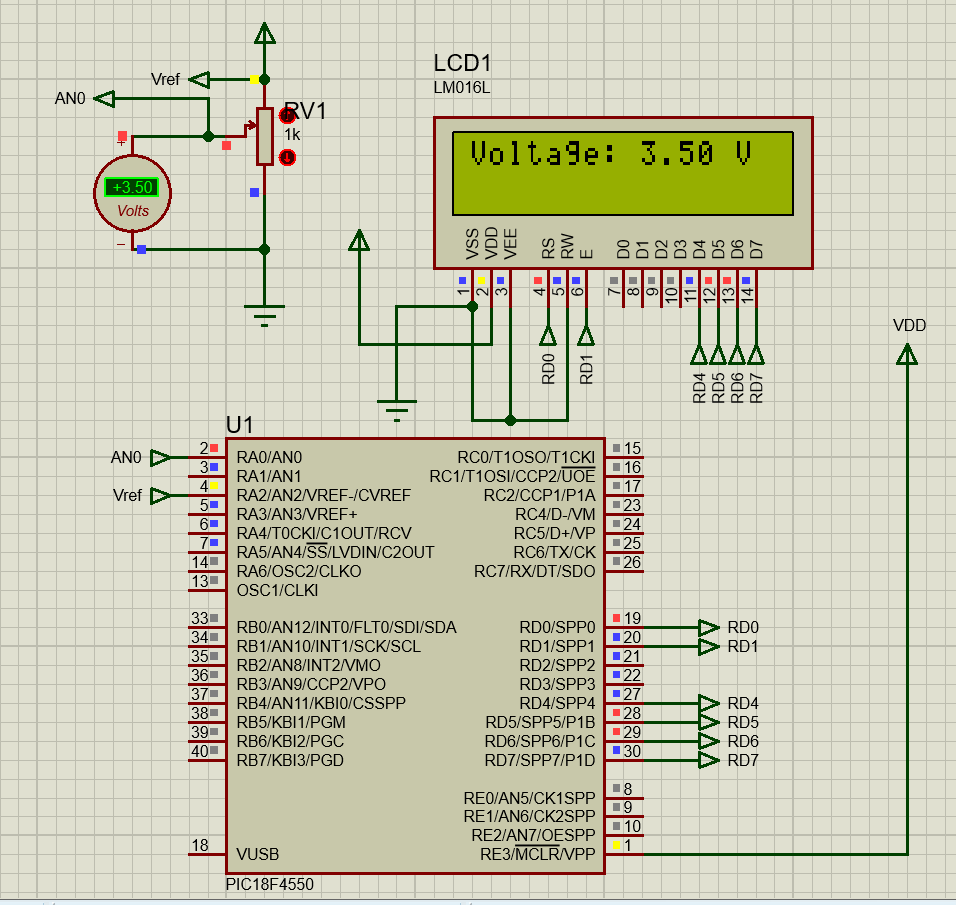

### PIC DC Voltimeter

#### 0 - 5V Voltimeter using PIC18F4550 A/D converter.

#### Headers
 - xc.h
 - stdint.h
 - [lcd_api.h](https://github.com/ohananoshi/LCD_16x2_API)

#### Constants

- #### LCD Configs
```C
#define LCD_4BIT_INTERFACE
#define LCD_D7 PORTDbits.RD7
#define LCD_D6 PORTDbits.RD6
#define LCD_D5 PORTDbits.RD5
#define LCD_D4 PORTDbits.RD4
#define LCD_EN PORTDbits.RD1
#define LCD_RS PORTDbits.RD0
```

- #### A/D Channels
  - CH_0  ```used chanel```
  - CH_1
  - CH_2
  - CH_3
  - CH_4
  - CH_5
  - CH_6
  - CH_7
  - CH_8
  - CH_9
  - CH_10
  - CH_11
  - CH_12

#### Functions

```C
uint16_t AD_convert(uint8_t AD_channel);
float voltage(uint8_t AD_channel);
```

#### Proteus Simulation
